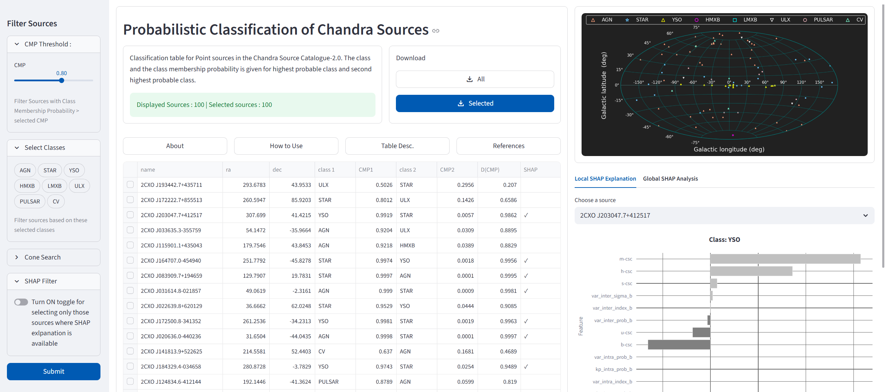
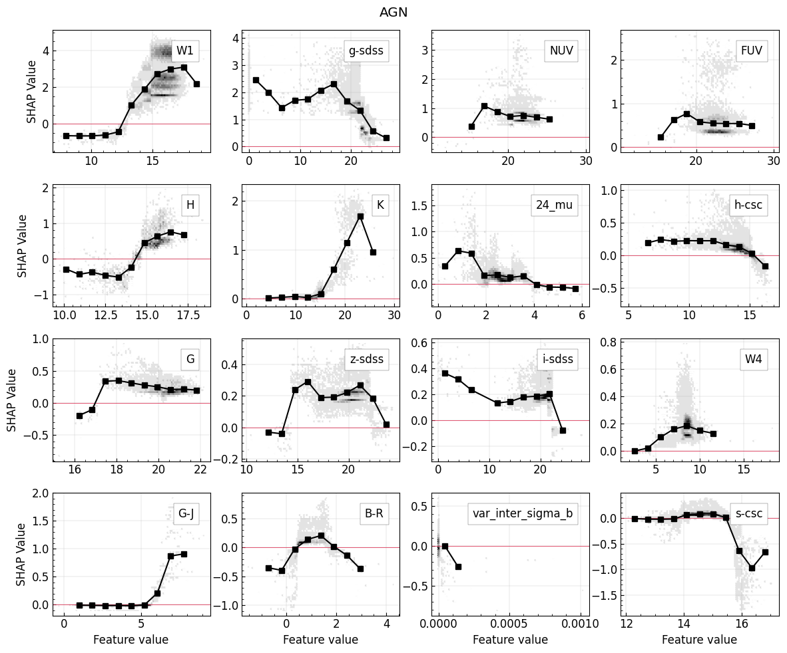
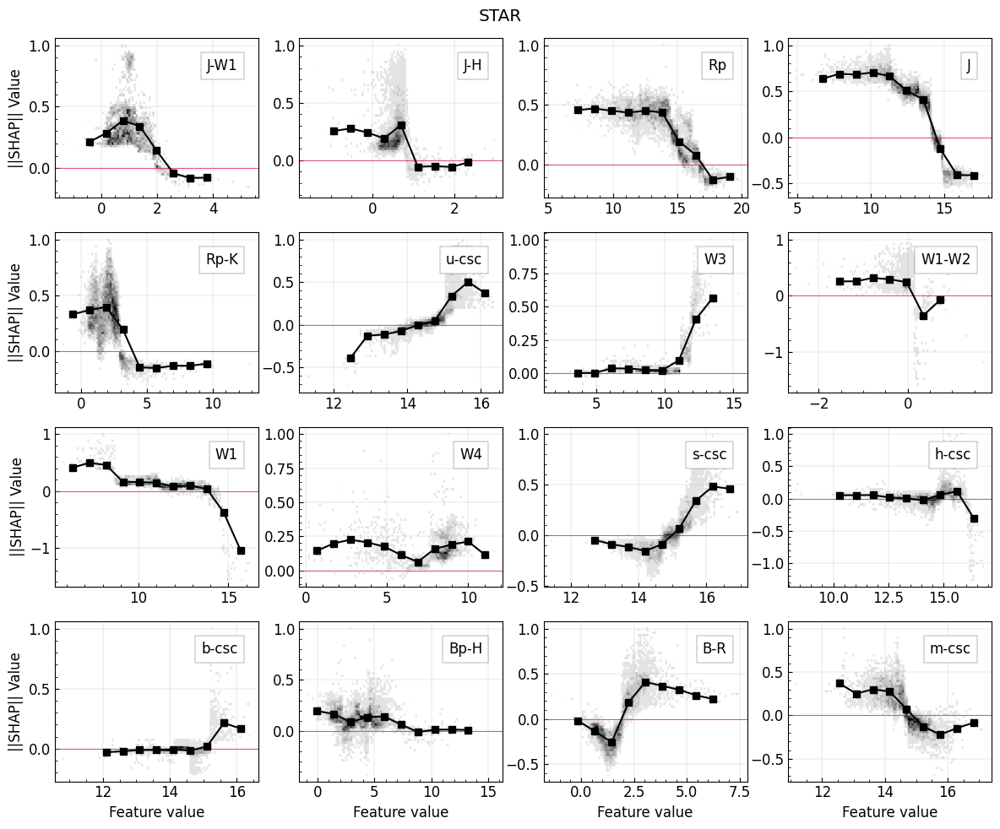
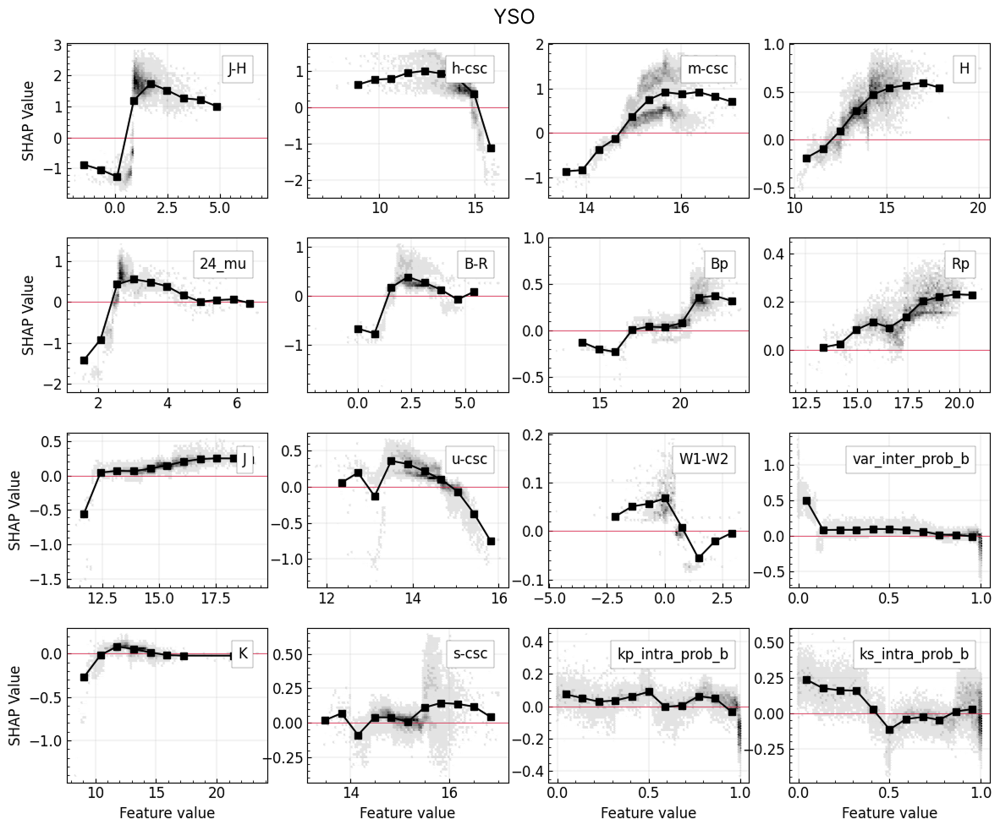

# Explainable machine learning classification of Chandra X-ray sources: SHAP analysis of multi-wavelength features

[https://chandraxai.streamlit.app/](https://chandraxai.streamlit.app/)

## Introduction 
The *Chandra* X-ray Observatory has accumulated more than a million detections over two decades, spanning a mixture of active galactic nuclei (AGNs), Young stellar objects, X-ray binaries, pulsars, cataclysmic variables among others.  

The Chandra Source Catalogue contains about 300,000 X-ray point sources. The nature of majority of them is not unconfirmed. In **Kumaran et.al 2023** we used LightGBM decision tree based model to clasify 277,069 objects into 8 class of X-ray emitting sources : Active Galactic Nuclei (AGN), Young Stellar Object (YSO), X-ray emitting Stars (STAR), High Mass X-ray Binary (HMXB), Low Mass X-ray Binary (LMXB), Cataclysmic Variable (CV), Ultra-luminuous X-ray Sources (ULX), Pulsar (PULSAR). For classification we use 41 multiwavelength features (see Table 2 of **Kumaran et.al 2023* for the details of these features).

* Out of the selected 277069 point sources in the CSC-2.0, we identified the class of 7703 objects using the published literature.
* We trained a LightGBM model to assign class membership probabilities to remaining 269366 sources with unknown class.
* This protal presents the classification table of 269366 sources including 54,770 robustly classified sources (over $3\sigma$ significance)$^2$ and 14,066 sources at $>4\sigma$ significance.

### SHAP Analysis
For investingating the multiwavelength properties curical for class-wise identification of these objects, we applied SHAP analysis, an Explainable-AI technique for the majority classes : AGN, Star and YSO. Using SHAP analysis, we obtain local explanation of individual sources and their feature dependency. The paper **Kumaran et.al. (under review)** discuss the analysis in detail. 

## The Data and SHAP portal
### Classification table description: 
*    Column 1: Name : (Observation ID of the source in the CSC-2.0)
*    Column 2: ra (J2000) in deg
*    Column 3: dec (J2000) in deg
*    Column 4: class 1: Predicted class with highest CMP
*    Column 5: CMP1: probability for highest probable class
*    Column 6: class 2: Predicted class with second highest CMP
*    Column 7: CMP2: probability of second highest class.
*    Column 8 : SHAP : '✓' sign indicates, that SHAP analysis is available for this sources

Machine readble data table is available at [Zenodo](https://doi.org/10.5281/zenodo.17346885)

Interactive Local and global explanation of CMP is at the web portal [https://chandraxai.streamlit.app/](https://chandraxai.streamlit.app/)

### How to use the portal :

1. When the portal first loads, it 100 sources selected at random from the catalog of 269366 sources.
2. Use the sidebar to obtain catalogue of all sources based on the following **filters**: 

| CMP Threshold | Select Classes | Cone Search | SHAP filter |
|----------------|----------------|-------------|-------------|
| Use the slider to adjust the CMP threshold. | Select the classes to be included in the result. | Enter RA, DEC and the search radius | SHAP analysis is done only for high-confident sources belonging to the majority classes: AGN, YSO and STAR. Turnging on this toggle will filter only those sources where SHAP analysis is available.|
3. After setting these filture press the `SUBMIT` button to obtain the filtered data-table.
4. Based on the filter, the classifiction table is loaded in the central panel.
5. When the table loads, all the sources are selected by default.
6. Select a subset of sources using the checkbox (first un-named column).
7. For selected sources, the sky location are shown in the top-right corner.
8. In the Local explanation tab, select individual sources from the down (only those sources appear in the drop-down for which SHAP value is available) to get the feature importance for that particular source.
9. In the Global Explanation tab, the feature-SHAP relation scatter plot is shown for the selected sources.

### Illustration : Reproducing _Fig 5._ and _Fig. 7_ from the paper **Kumaran et.al (under review)**

1. Sidebar filters: 
    * Set the CMP threshold to 0.97
    * Select only "AGN"
    * Leave the 'Cone Search' filter blank
    * Turn ON the SHAP toggle
2. Preshh `Submit` button
3. After table loads, Use top-left corner in the table to select all the rows.
4. In the Local Explanation tab (bottom right panel) click the drop down
5. Select the source '2CXO J01422.8-005331' from the drop-down or type this source ID, it will give the local explanation of this source as in the _Fig.5_
6. Go to 'Global Explanation tab'
7. Under the drop-down,select 'W1' feature. This will generate the 1st panel of AGN row in the Fig 5.
8. Similarly other features can be selected from the drop-down
9. For other class, in step 1, select 'Star' or 'YSO' to reproduce next two rows.
10. Use these filters, by selecting multiple classes to see the SHAP feature plots for all possible combinations of classes and features.
11. As an illustration, select all three AGN, STAR and YSO and see the comparison of global SHAP-feature plot.

_note : Due to difference in scatter-point size and opacity the  plot in the portal will not be exactly identical as the paper._

### Additional Plots : SHAP-feature plots for top 12 features

### References 

 1. **Classification Paper** : Kumaran et al. 'Automated classification of Chandra X-ray point sources using machine learning methods.' MNRAS 520.4 (2023): 5065-5076.
2. **SHAP analysis Paper** : Kumaran et al. 'Explainable machine learning classification of Chandra X-ray sources: SHAP analysis of multi-wavelength features.' ApJ, Under review.
3. **Chandra Source Catalogue-2.0**: Evans, Ian N., et al. "The chandra source catalog." The Astrophysical Journal Supplement Series 189.1 (2010): 37.
4. SHAP Analysis : 
    * Lundberg, Scott M., et al. "From local explanations to global understanding with explainable AI for trees." Nature machine intelligence 2.1 (2020): 56-67.
    * SHAP python package : https://shap.readthedocs.io/en/latest/
5. Astropy Collaboration (2018). Price-Whelan, Adrian M., et al. "The astropy project: Building an open-science project and status of the v2. 0 core package." The Astronomical Journal 156.3 (2018): 123.
6. Portal developed using Streamlit framework. *Streamlit Documentation*. https://docs.streamlit.io  

---

### How to cite

1. Kumaran et al. 'Explainable machine learning classification of Chandra X-ray sources: SHAP analysis of multi-wavelength features.' ApJ, Under review.
2. Kumaran et al. 'Automated classification of Chandra X-ray point sources using machine learning methods.' MNRAS 520.4 (2023): 5065-5076.